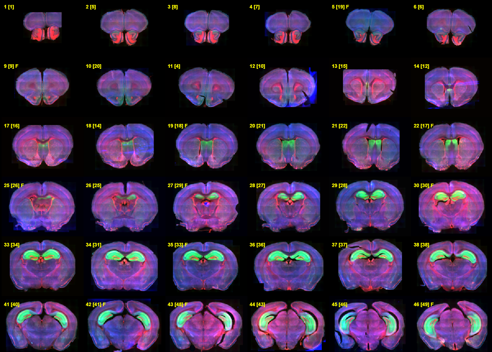
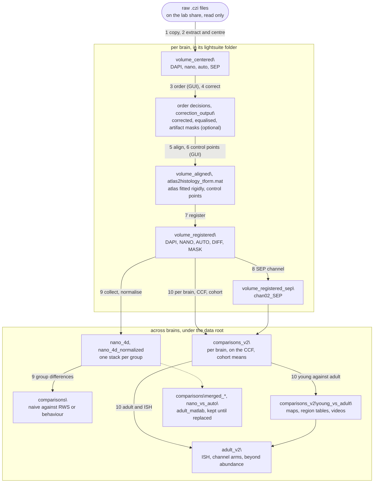

# SEP-GluA1 whole-brain maps: analysis code

*A P16 brain (MG911) in the slice-order editor of `run_order_slices`, six of
its eight columns: each section labelled with its place in the curated order,
its index as extracted in brackets, F if flipped; red = DAPI, green =
nanobody, blue = autofluorescence.*

Whole-brain maps of surface GluA1, an AMPA receptor subunit, in SEP-GluA1
knock-in mice. Sections are stained with a GFP-booster nanobody that binds
the SEP tag, without detergent or with very little, so only receptors at the
surface should be labelled; no control has tested this on these brains yet.
Each section is imaged in four channels (DAPI, nanobody, autofluorescence and
the green of SEP itself) and registered to the atlas of the mouse's age: the
Allen CCF for adults, DeMBA (Carey 2025) for young mice. The project serves
Aim 2.1 of the SNSF Weave grant *Dendritic plasticity rules shaping the
emergence of multisensory integration in the developing cortex*. The grant's
dendritic imaging is in [dendritic-visuotactile-imaging](https://github.com/gmatteuc/dendritic-visuotactile-imaging).
Background and results in [`docs/SCIENTIFIC_CONTEXT.md`](docs/SCIENTIFIC_CONTEXT.md).
There are four lines of work:

1. Where an experience changes the map: naive mice against mice after
   rhythmic whisker stimulation (RWS) or a detection task. Paused, not closed.
2. How the signal is distributed in the adult brain, and how reproducibly.
3. What the map measures, against Allen in situ hybridisation (ISH) and the
   SEP channel.
4. How young brains differ from adult ones, for the grant.

## Setup

MATLAB R2024b on Windows (R2022b at least), with the Image Processing,
Computer Vision, Optimization, Statistics and Machine Learning, and Parallel
Computing toolboxes; elastix 5.1.0 on the PATH, for LightSuite (below).
Start each session with
`restoredefaultpath; cd('D:\sep_histology\code'); sep_setup_paths`. Code and
data sit side by side, in `<root>\code` and `<root>\data`, the atlases in the
data root (`atlas\`, `atlas_demba_p<age>\`); `get_paths.m` and
`mapping/sepmap/config.py` find the data next to the code. `SEP_DATA_ROOT`
points a run at a copy of the data, and a copy of the code refuses to run on
the production data.

LightSuite calls elastix and transformix from the command line, so they are
installed once per machine, outside the repository: download elastix 5.1.0
for Windows from its
[release page](https://github.com/SuperElastix/elastix/releases/tag/5.1.0),
unzip it into a folder of its own (on the analysis computer
`C:\Users\<user>\elastix`, which holds `elastix.exe`, `transformix.exe` and
`ANNlib-5.1.dll`; the Linux and macOS packages put them in `bin/`), add that
folder to the system Path ("Edit the system environment variables",
Environment Variables, Path, New), and check in a new terminal that
`elastix --version` prints `elastix version: 5.1.0`.

Python is Anaconda's 3.12.7, in environments git ignores, each made as the
top lines of its `tools\requirements_*.txt` say: `tools\venv_flat` runs
`mapping/run_closeup.py`, `tools\venv_atlas` the rest of `mapping/` and
`atlas/build_demba_atlas.py`, `tools\venv_dev` pytest and ruff. Once per
machine, `registration\auto_annotation\setup.ps1` makes the automatic
annotation's own; without it the control-point GUI has no automatic keys.

## Folders

`preprocessing/`, `registration/` and `group_comparison/` have their drivers
(`run_*.m`) at the top and the functions only they use in `pipeline/`. Tools
run by hand sit beside the drivers, and a self-contained component has a
subfolder of its own (`registration/annotation_gui/`,
`registration/auto_annotation/`). The Python route has its drivers in
`mapping/` and its code in `mapping/sepmap/`.

| folder | what |
|---|---|
| `preprocessing/` | raw `.czi` files to centred, ordered, corrected sections ([README](preprocessing/README.md)) |
| `registration/` | sections to the atlas, the SEP channel, the automatic annotation ([README](registration/README.md)) |
| `group_comparison/` | line 1, naive against RWS or behaviour ([README](group_comparison/README.md)) |
| `mapping/` | lines 2 to 4, in Python ([README](mapping/README.md)) |
| `adult_matlab/` | three earlier MATLAB analyses of lines 2 and 3, kept until `mapping/` answers their questions, A1 to A5 of the [roadmap](docs/ROADMAP.md) ([README](adult_matlab/README.md)) |
| `common/`, `atlas/` | the cohort table, volume reading, colours; `get_atlas`, the DeMBA builder, atlas checks ([README](common/README.md), [README](atlas/README.md)) |
| `tests/`, `tools/` | two MATLAB tests; the detached runner and the checks that a change does not change the results ([README](tests/README.md), [README](tools/README.md)) |
| `docs/` | [scientific context](docs/SCIENTIFIC_CONTEXT.md), [adding data](docs/ADDING_DATA.md), [figures](docs/FIGURES.md), [code style](docs/STYLE.md), [roadmap](docs/ROADMAP.md); the specification of A1 to A10 in [REFACTOR_COVERAGE.md](docs/REFACTOR_COVERAGE.md) and [adult_ish_design.md](docs/adult_ish_design.md); the old and new script names in [refactor_name_map.csv](docs/refactor_name_map.csv); the refactor's plan and reports in [history/](docs/history/README.md) |
| `assets/` | the image at the top of this README |
| `third_party/`, `archive/` | LightSuite (local changes listed in its `PATCHES.md`), matlab_elastix, yamlmatlab, BioformatsImage; retired code, kept until checked ([README](third_party/README.md), [README](archive/README.md)) |

*Nomenclature note.* nano is the nanobody channel (Cy5), auto the
autofluorescence (Cy3), SEP the green channel (filter EGFP). Files carry dye
names up to `volume_centered\` (`chan02_Cy5`), role names after (`chan02_NANO`).
`P<n>` in an age, cohort tag or atlas key is postnatal day n (`young_P20`); a
young mouse's age is in its folder name (`MG904_SepGluA_P22` is P22). The
scripts were once named P0 to P10; `docs/ADDING_DATA.md` has the old and new
names. The Python route reads the map five ways, `ratio`, `sepratio`, `cref`,
`subref` and `zref`, defined in `mapping/sepmap/volumes/cohort.py`.

## The pipeline

A brain's stages are in `<data>\<group>\<mouse>\lightsuite\`. The drivers:

1. Copy, `preprocessing/run_copy_raw_data`. Copies the `.czi` files from the
   lab share, which is never written to, and checks their sizes.
2. Extraction, `preprocessing/run_extract_and_center`. Centres every channel
   and makes a colour composite for the ordering.
3. Slice order, `preprocessing/run_order_slices`. Reorder, flip and discard
   slices by hand in SliceOrderEditor.
4. Correction, `preprocessing/run_residual_correction`, `run_nano_equalisation`
   and, optionally, `run_annotate_artifacts`. Subtracts the autofluorescence,
   scaled to the nano per slice, then equalises the nano across slices.
5. Alignment, `registration/run_register_to_atlas` with `run_mode = 'align'`.
   Applies the slice order, aligns the slices and fits the atlas rigidly.
6. Control points, the same driver, by hand. `'angle'` sets the cutting angle
   (optional), `'annotate'` the plane on four anchor slices, `'autoannotate'`
   proposes the points and `'annotate'` again reviews them. Without the
   engine, `'annotate'` alone, every point by hand.
7. Registration, `run_mode = 'register'`. Refines every slice with elastix
   and writes the five channels on the 10 µm grid all brains share.
8. SEP channel, `registration/run_add_sep_channel`. Re-applies the saved
   transforms to the green channel, without refitting. 30 to 45 min per brain.
9. Plasticity comparison, `group_comparison/run_collect_by_group`,
   `run_normalise_groups`, `run_group_differences`. Puts the mice of a group
   on one intensity scale, folds each brain onto its left hemisphere (L - R
   and L + R) and maps the Welch t between the groups.
10. Mapping, `mapping/run_per_mouse.py`, `run_to_ccf.py` and
    `run_diagnostics.py` per brain, then `run_cohort.py` and the rest in the
    order of the table in [`mapping/README.md`](mapping/README.md).

## How to run

- A new brain: add its row at the end of `common/cohort.csv`, then follow
  [`docs/ADDING_DATA.md`](docs/ADDING_DATA.md).
- A MATLAB step: open the driver, set its `%% Settings` and run it. Long
  stages run detached, with a log, through `tools\run_matlab_detached.ps1`.
- A Python step, from the code root (`--help` lists the options):
  `tools\venv_atlas\Scripts\python.exe mapping\run_per_mouse.py <mouse>`.
- The plasticity comparison approved on 5 December 2025 is in
  `comparisons\naive_vs_rws\` and `naive_vs_behavior\`; today's code writes
  `naive_vs_<exp>_nano\` beside them, last on 5 October 2026
  ([how](group_comparison/README.md)).

## Where to change

| what | where |
|---|---|
| paths | `get_paths.m`, `mapping/sepmap/config.py` |
| the cohort | `common/cohort.csv`, read by `get_cohort` and by `config.py` |
| the 100-gene ISH panel | `mapping/gene_targets.csv`; `run_compare_with_allen_ish` reads its copy `<data>\gene_targets.csv` |
| a MATLAB step | the `%% Settings` block of its driver |
| the adults of the plasticity comparison | `selected_mice_idx_list` in `run_normalise_groups` and `run_group_differences`, which must agree; `behavior_mice` in the second |
| Python parameters | `mapping/settings.toml`; run options on the command line |
| Python readings and cohorts | `mapping/sepmap/volumes/cohort.py`; a new age also in `mapping/sepmap/young_vs_adult/region_plot.py` and `compare.py`, and in `videos.min_n` of `mapping/settings.toml` |
| atlases | `atlas/get_atlas.m`; a new age, `atlas/build_demba_atlas.py <age>` |
| control-point checks | `registration/annotation_gui/annotation_settings.m` |
| colours | `common/sep_palette.m`, `mapping/sepmap/plotting.py` |

After a change, run the old and the new code on copies of the data and
compare the outputs with the tools in `tools/`. Follow the
[code style](docs/STYLE.md) and run the tests in `tests/`.

## Notes

- The plasticity comparison fits each mouse onto its group, and the
  experimental group onto the control one. The Python route scales each brain
  on its own. A result that uses both routes must make them comparable first.
- Data is excluded at four levels: slices, by hand at step 3; mice, by
  `selected_mice_idx_list` (four of the seven behaviour mice are kept) and
  `behavior_mice`, or by an empty `mapping_cohort` in the Python route;
  voxels, outside a brain's tissue or covered by too few brains
  (`min_mice_per_group`, 3 per group for a t; `young_vs_adult.min_n_*` and
  `videos.min_n`); structures, below `region_tables.min_vox20`.
- Voxels no section reached hold 0 in the registered volumes. The plasticity
  comparison and the Python route read that 0 as missing and keep excluded
  data as NaN, never zero, so it stays out of means. `adult_matlab/`, kept as
  it was, still sets some of it to zero.
- The green channel tracks the autofluorescence (rho 0.79 across the ten
  adults), so nano/SEP is not a surface fraction.
- Young and adult brains were imaged in different sessions, so only patterns
  compare across ages, not levels.
- Do not align an annotated brain again, extract a registered one or equalise
  an aligned one; why, under Traps in `docs/ADDING_DATA.md`.

## Outputs and versions

- Outputs go under the data root, never into git. Per brain, the `.czi`
  copies and every stage are in `<group>\<mouse>\`. The plasticity stacks are
  in `<group>\`. The plasticity comparison and `adult_matlab/` write to
  `comparisons\`, the Python route to `comparisons_v2\` and `adult_v2\`.
  Which script makes which figure: [`docs/FIGURES.md`](docs/FIGURES.md).
- The Python route and the group-difference step were rerun with the
  refactored code on 5 October 2026. The Python route's outputs from before,
  the state behind the grant figures, are in
  `backup_before_rerun_2026-10-05\` under the data root; the data tree of
  30 September is also in the snapshot `G:\sep_histology_snapshot_2026-09-29`.
- `main` is the working branch. Tags: `grant-2026-09` (grant figures),
  `before-refactor` (snapshot of 29 September 2026), `refactor-start` (start
  of the reorganisation), `pre-auto-annotation` (before the automatic
  annotation).
